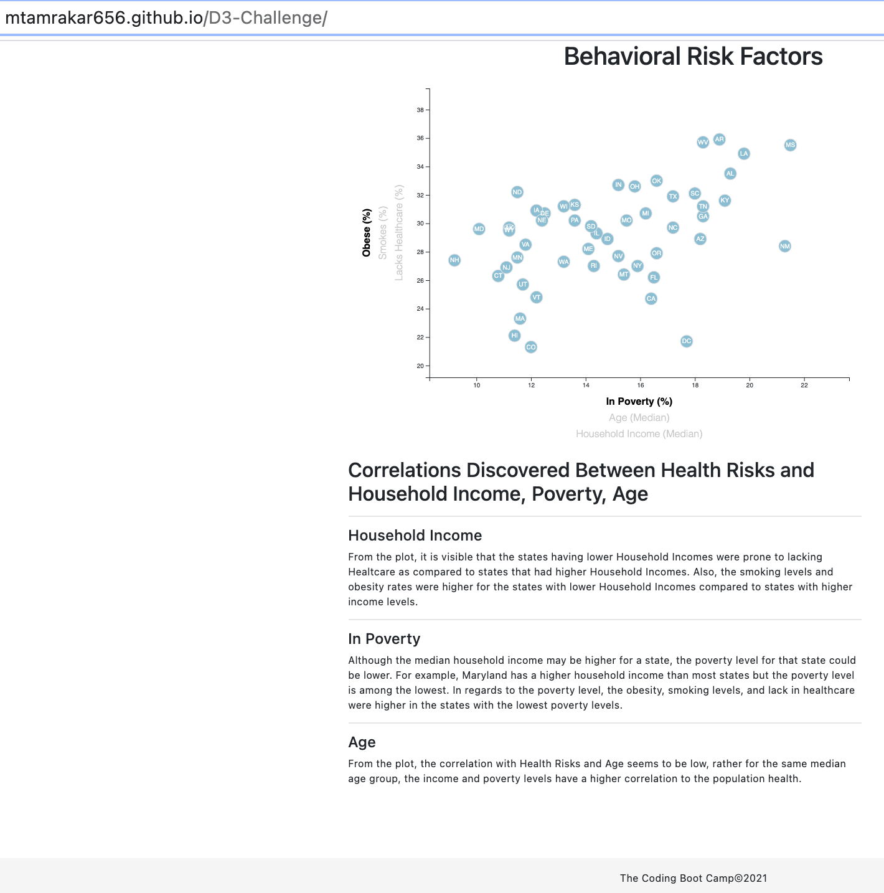

# D3-Challenge - Data Journalism and D3

## Background
The task is to analyze the current trends shaping people's lives, as well as creating charts, graphs, and interactive elements to help readers understand our findings.

* The editor wants to run a series of feature stories about the health risks facing particular demographics. 
* We will be sifting through information from the U.S. Census Bureau and the Behavioral Risk Factor Surveillance System.
* The data set included with the assignment is based on 2014 ACS 1-year estimates from the US Census Bureau.
* The current data set includes data on rates of income, obesity, poverty, etc. by state.

